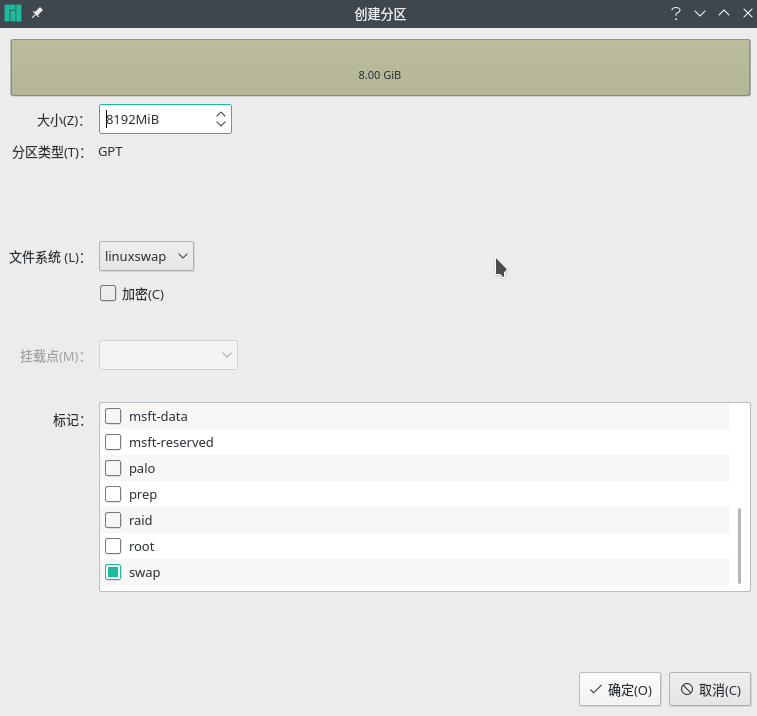

> This was the first blog I ever posted on the internet when I was in my second year of college and I found installing manjaro to be a very complicated work for me at that time, so I wrote down how to install manjaro dual system on Windows and initially posted it in the [cnblogs](https://www.cnblogs.com/Jaywhen-xiang/p/11561661.html), which really helped many people at that time, nostalgic old days


### 〇、README

本人电脑相关配置：单硬盘 UEFI+GPT 格式启动 Win10 家庭版如上所说，本篇博文只适用于启动方式为 UEFI+GPT

### 一、前言

Manjaro 是一款基于 Arch Linux 的、用户友好的发行版，虽然 Manjaro is not Arch，但它依然能够从 AUR(Arch User Repository)中提取软件包，且有自己的独立库。

它有且不仅有如下特性：

- **Pre-installed** （在你还没正式安装时，你便可从启动盘直接流畅体验它的桌面系统）
- 快、强、高效
- 滚动发布，无需定期更新系统版本
- ……

### 二、准备工作

1.  **查看电脑的启动方式:**

目前主流的两种启动系统的方式： legacy 启动+MBR 分区表, **UEFI**启动+**GPT**分区表

我们需要查看自己硬盘使用的哪种分区：

> 文件资源管理器->（右键）此电脑->管理->磁盘管理


由于我的电脑是[单硬盘]，所以只有一个磁盘 0 右键选择一个磁盘->属性->卷 在磁盘分区形式一栏中可以看到是 GPT or MBR

2.  **下载 manjaro 镜像：**

官网下载镜像的速度会非常慢，所以这里可选择在清华大学开源软件镜像站下载 manjaro kde 的镜像文件：


3. **制作启动盘：**


制作启动盘官方文档推荐使用[Rufus](http://rufus.ie/)或[Image Writer](https://launchpad.net/win32-image-writer/)，我这里使用 Rufus 来制作

插入 u 盘，打开`Rufus`，我的分区类型一栏选择的是`GPT`，其他的都为默认，点击`开始`后弹出该窗口，点击以`DD`镜像模式写入


4. **在 Windows 上为 manjaro 分配磁盘空间：**

此电脑–管理–磁盘管理 选一块空间充裕的盘，从上面分一部分空间（大小因需求而异）:

空间充裕的盘–压缩卷–想要分配的空间大小–压缩

压缩完了就可暂时不用管了，**不用格式化**，后面会用到

5.**关闭 windows 快速启动与安全启动**

快速启动：参考[这篇文章](https://jingyan.baidu.com/article/48b558e30ca7977f38c09a95.html)

安全启动：BIOS–System Configuration–Boot Options–Secure Boot–Disabled

### 三、开始安装

1、**设置从 U 盘启动：** Windows 设置–更新和安全–恢复–立即重新启动

2、**配置选项**

成功从 U 盘启动后，首先会进入配置界面，唯一需要注意的是 driver 的选择

参考 Manjaro 用户指南：

```
Free :

drivers are open-source, like Manjaro itself, written and updated by a large

community. For AMD graphics cards and hardware with Intel-based integrated

graphics, this is the best choice.

Non-Free :

drivers are closed-source, written and updated only by the hardware manufacturers.

This is generally the best choice for newer Nvidia dedicated graphics. For older

Nvidia hardware the Free drivers work very well.

If in doubt, choose Free drivers. If you want to play games with an Nvidia

graphics card, choose non-Free drivers.

(满足以下条件选择)Free:
驱动是开源的，例如Manjaro自身，由一个大型社区编写与更新；
AMD的显卡 || 基于Intel的集显；
很老的Nvidia显卡；
实在不知道怎么选，或者条件(模糊)都不怎么满足

(满足以下条件选择)Non-Free:
驱动是闭源的，仅由硬件制造商编写与更新；
新的Nvidia显卡；
想用Nvidia显卡打游戏

```

设置完毕后，enterBoot 进入桌面

3、**分区**

选择手动分区, 找到在 Windows 上划分的空闲区,点击创建

- swap



- boot


- /


- /home


4、**挂载 Manjaro 引导**

此时找到大小为 100M 的分区 这里面有 Windows 的引导分区，所以内容点保留 将 manjaro 也挂载在上面，如图所示：


### 四、完成

```bash
sudo pacman-mirrors -c China -m rank # 更改源
```

增加中文社区的源，在 `/etc/pacman.conf` 中添加 `archlinuxcn` 源，加上：

```
[archlinuxcn]
SigLevel = Optional TrustedOnly
Server = https://mirrors.tuna.tsinghua.edu.cn/archlinuxcn/$arch
```

安装 `archlinuxcn-keyring` 包以导入 `GPG key`，否则的话 key 验证失败会无法安装：

```bash
sudo pacman -Sy archlinuxcn-keyring
sudo pacman -Syy #更新
```

```bash
sudo pacman -S yay                     # Arch Linux AUR 包管理工具
```

```bash
# 解决双系统时间不同步问题
timedatectl set-local-rtc true
```

输入法：

```bash
sudo pacman -S fcitx fcitx-configtool
//建议就这样，然后在fcitx设置里面选择自带的拼音输入法和英语输入法就好了
//搜狗输入法总是用不了多久就出bug，很不稳定，会造成不必要的麻烦
//以下是安装搜狗输入法
sudo pacman -S fcitx-gtk2 fcitx-gtk3 fcitx-qt4 fcitx-qt5 fcitx-sogoupinyin
#解决中文输入法无法切换问题: 添加文件 ~/.xprofile：
export GTK_MODULE=fcitx
export QT_IM_MODULE=fcitx
export XMODIFIERS="@im=fcitx"
#若以上执行完后无法输入中文，只能显示字母
#删掉~/.conf下所有与Sogou相关的文件夹
yay -S fcitx -im
sudo pacman -S fcitx-qt4 fcitx-qt5 fcitx-gtk2 fcitx-gtk3
#若输入法中文乱码
将搜狗输入法调整至输入法序列第二位
```

```bash
# 手动安装oh-my-zsh
git clone https://github.com/ohmyzsh/ohmyzsh.git ~/.oh-my-zsh
cp ~/.oh-my-zsh/templates/zshrc.zsh-template ~/.zshrc
# ----------------------------------------------------------------

# 一些软件
sudo pacman -S google-chrome
sudo pacman -S visual-studio-code-bin 	# vscode
yay -S typora 			        # markdown编辑利器
yay -S deepin-wine-tim			# Tim

#----upd：2020/4/28--
#----2020/4/28版本的TIM无法输入中文解决：
#编辑 /opt/deepinwine/apps/Deepin-TIM/下的  run.sh文件
#加入：
export GTK_IM_MODULE="fcitx"
export QT_IM_MODULE="fcitx"
export XMODIFIERS="@im=fcitx"
```

### 六、参考

[Manjaro-User-Guide](https://mirrors.tuna.tsinghua.edu.cn/osdn/storage/g/m/ma/manjaro/Manjaro-User-Guide.pdf)
