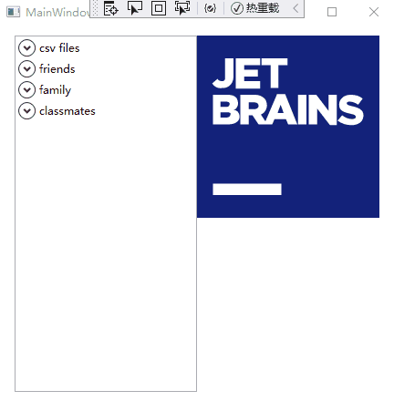
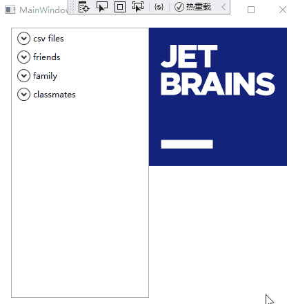
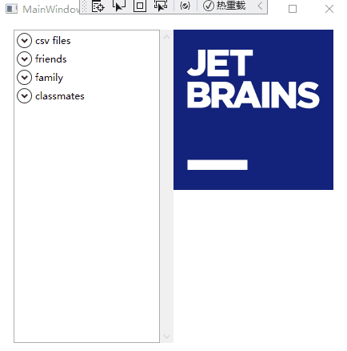

> 在 WPF .NET Core 中使用以下代码打开浏览器进入网页将会报错，而在 WPF .NET Framework 中却不会

```csharp
public void OpenWebLink(string url)
{
    try
    {
        Process.Start(url);
    }
    catch (Exception e)
    {
        //Some exception handling code
        // ...
    }
}
```

将上述代码改为：

```csharp
public void OpenWebLink(string url)
{
    try
    {
    	var psi = new ProcessStartInfo
			{
    	    FileName = url,
    	    UseShellExecute = true
			};
			Process.Start(psi);
    }
    catch (Exception e)
    {
        //Some exception handling code
        // ...
    }
}
```

则不会有异常，因为 `UseShellExecute` 属性在.NET Core 中默认为 `false`，要打开一个网页链接应该将其设为 `true`，因为 url 并不是一个可执行文件。

---

我需要实现一个类似 QQ 好友分组的数据展示，需要用到两个 ListView 嵌套，代码大致如下：

```xml
<ListView
          ItemsSource="{Binding datas}"
    <ListView.ItemTemplate>
        <DataTemplate>
            <Expander>
                <Expander.Header>
                    <TextBlock Text="{Binding name}"/>
                </Expander.Header>
                <Expander.Content>
                    <ListView
                              ItemsSource="{Binding name}"
                              >
                    </ListView>
                </Expander.Content>
            </Expander>
        </DataTemplate>
    </ListView.ItemTemplate>
</ListView>
```

当把数据绑定上去后，发现分组元素可以滚动，但分组内的元素无法滚动：



根据网上大家所说是因为 ListView 内本身就含有一个 ScrollViewer，当两个 ListView 嵌套时，鼠标滚轮事件首先被内层的 ListView 接收，而内层的 ListView 的滚动条在此时是被禁用的(至少看起来是这样的)，此时当数据超出一定长度时显示出来的滚动条是外部 ListView 的，故当鼠标在内层 ListView 中滚动时，内层的元素无法滚动。

自此解决思路自然是将内部滚轮事件拦截下来，标记为已处理，然后手动激发一个滚轮事件，并将这个事件冒泡至上层的 ListView 来进行处理，于是添加一个 PreviewMouseWheel 事件:

```xml
<ListView
          ItemsSource="{Binding datas}"
    <ListView.ItemTemplate>
        <DataTemplate>
            <Expander>
                <Expander.Header>
                    <TextBlock Text="{Binding name}"/>
                </Expander.Header>
                <Expander.Content>
                    <ListView
                              PreviewMouseWheel="ListView_PreviewMouseWheel"
                              ItemsSource="{Binding name}"
                              >
                    </ListView>
                </Expander.Content>
            </Expander>
        </DataTemplate>
    </ListView.ItemTemplate>
</ListView>
```

```csharp
private void ListView_PreviewMouseWheel(object sender, MouseWheelEventArgs e)
{
    if (!e.Handled)
    {
        // ListView拦截鼠标滚轮事件
        e.Handled = true;

        // 激发一个鼠标滚轮事件，冒泡给外层ListView接收到
        var eventArg = new MouseWheelEventArgs(e.MouseDevice, e.Timestamp, e.Delta);
        eventArg.RoutedEvent = UIElement.MouseWheelEvent;
        eventArg.Source = sender;
        var parent = ((Control)sender).Parent as UIElement;
        parent.RaiseEvent(eventArg);
    }
}
```

此时虽然鼠标滚轮事件在内层也能工作了，但是却出现了新的问题:



此时滚轮滚动过的单位依然是外层元素的实际高度(外层元素所包含的所有内层 ListView 的高度)。

这里我想到的方法是在外层 ListView 上嵌套一个 ScrollViewer ，并将外层 ListView 的鼠标滚轮事件冒泡给 ScrollViewer 来处理，这样外层 ScrollViewer 便能接收到最内层 ListView 的鼠标滚轮事件了:



大致代码如下:

```xml
<ScrollViewer>
    <ListView
              ItemsSource="{Binding datas}"
              PreviewMouseWheel="ListView_PreviewMouseWheel"
              >
        <ListView.ItemTemplate>
            <DataTemplate>
                <Expander>
                    <Expander.Header>
                        <TextBlock Text="{Binding name}"/>
                    </Expander.Header>
                    <Expander.Content>
                        <ListView
                                  PreviewMouseWheel="ListView_PreviewMouseWheel"
                                  ItemsSource="{Binding name}"
                                  >
                        </ListView>
                    </Expander.Content>
                </Expander>
            </DataTemplate>
        </ListView.ItemTemplate>
    </ListView>
</ScrollViewer>
```

```csharp
private void ListView_PreviewMouseWheel(object sender, MouseWheelEventArgs e)
{
    if (!e.Handled)
    {
        // ListView拦截鼠标滚轮事件
        e.Handled = true;

        // 激发一个鼠标滚轮事件，冒泡给外层ListView接收到
        var eventArg = new MouseWheelEventArgs(e.MouseDevice, e.Timestamp, e.Delta);
        eventArg.RoutedEvent = UIElement.MouseWheelEvent;
        eventArg.Source = sender;
        var parent = ((Control)sender).Parent as UIElement;
        parent.RaiseEvent(eventArg);
    }
}
```

完整代码：[Github](https://github.com/jaywhen/LearnWPF/tree/main/ListDb)

参考：[.Net Core 3.1 Process.Start(“www.website.com”) not working in WPF](https://stackoverflow.com/questions/59716856/net-core-3-1-process-startwww-website-com-not-working-in-wpf)
