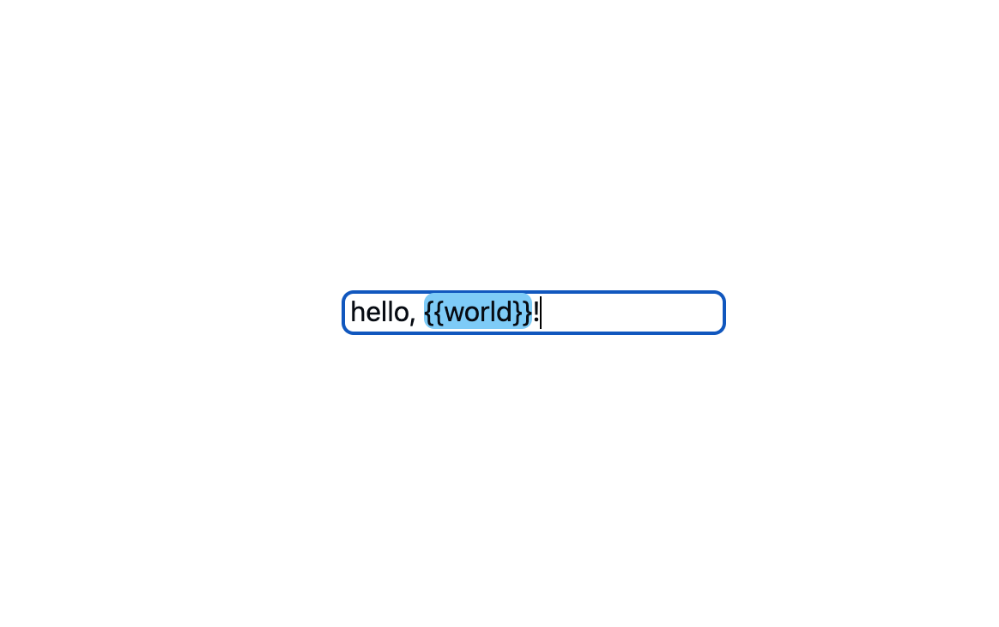

# Render HTML in input/textarea



Ok, it's not possible to render HTML in textarea or input natively. But can we implement this visually? Sure!

## Two elements & contenteditable

There are so many links explaining how to use the contenteditable attribute to make the content of your element editable:

- [MDN: contenteditable](https://developer.mozilla.org/en-US/docs/Web/HTML/Global_attributes/contenteditable)
- [Stackoverflow : Rendering HTML inside textarea](https://stackoverflow.com/a/4705882/12057370)

I am not recommend this as a practical way, cause even basic mark-up can disrupt the expected keyboard cursor movement. You should handle this manually. So let's talk about another way.

To achieve this, we put a styled element inside(by using absolute positioning) the real input/textarea element. And set both color and background-color attributes of input element to transparent.

```jsx
<div className="relative">
  <input className="relative text-transparent bg-transparent caret-black" />
  <div className="absolute top-0 left-0">
    {/* render some <span> elements in here */}
  </div>
</div>
```

When the input event is triggered, we process our input to a constructed array, and render them in that styled element:

```jsx
import React, { useState } from "react";

interface IInputChunk {
  type: string;
  value: string;
}

function App() {
  const REG = /({{.*?}})/g;
  const [value, setValue] = useState("");
  const [inputChunks, setInputChunks] = useState<IInputChunk[]>([]);

  const onInput = (event: React.SyntheticEvent) => {
    const inputValue = (event.target as HTMLInputElement).value;

    /** process your input */
    const chunks = inputValue.split(REG).map((str) => {
      if (str.match(REG)) {
        return {
          type: "var",
          value: str,
        };
      }

      return {
        type: "common",
        value: str,
      };
    });

    setInputChunks(chunks);
    setValue((event.target as HTMLInputElement).value);
  };

  return (
    <div className="relative">
      <input
        value={value}
        onInput={(event) => onInput(event)}
        className="relative text-transparent bg-transparent caret-black"
        type="text"
      />
      <div className="absolute top-0 left-0">
        {inputChunks.map((chunk, index) => {
          if (chunk.type === "var")
            return (
              <span key={index} className="py-[1px] bg-sky-300 rounded-md">
                {chunk.value}
              </span>
            );
          return <span key={index}>{chunk.value}</span>;
        })}
      </div>
    </div>
  );
}

export default App;
```

By using this absolute positioning, we make the styled content element behind the real input element, so the user is actually interacting with the real input element, and all of the keyboard functionality works as expected, the cursor position is retained. Color and background-color was set to transparent, so user will feel like they are interacting with the styled content visually.

## Demo

Here is a complete demo, it's written with react but since it not so complicated, you can implement this with any other frontend framework or vanilla JS:

- [CodeSandbox](https://codesandbox.io/p/github/jaywhen/render-html-in-input)
- [GitHub](https://github.com/jaywhen/render-html-in-input)

## References

- [Github-Blog: Creating an accessible search experience with the QueryBuilder component](https://github.blog/2022-12-13-creating-an-accessible-search-experience-with-the-querybuilder-component/)
