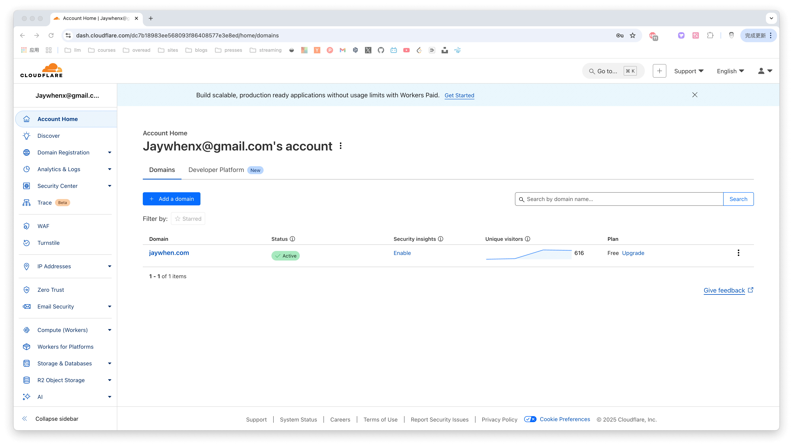
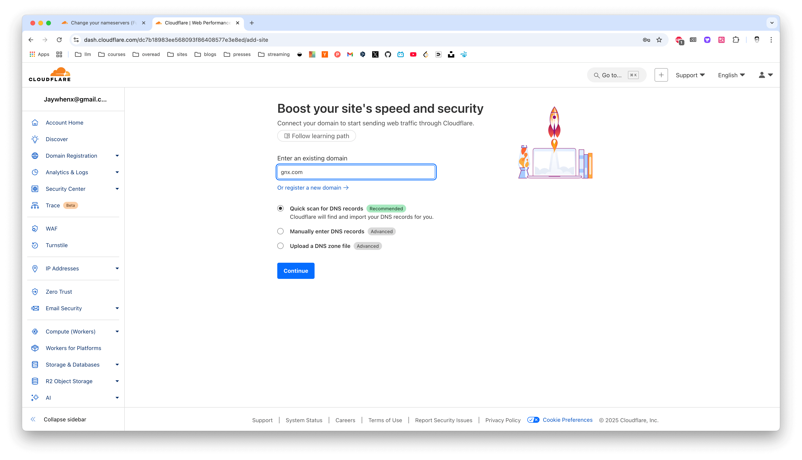
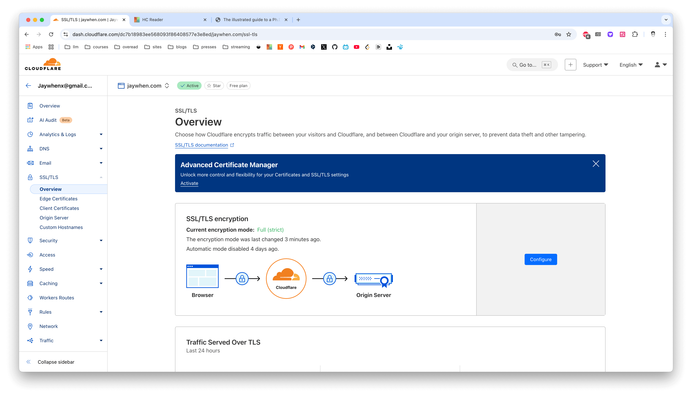
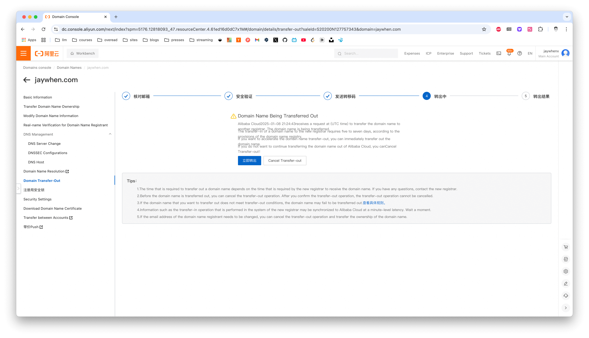

jaywhen.com was bought from Alicloud. Recently, I transferred it to Cloudflare (in China, we call Cloudflare the Cyber Bodhisattva(赛博菩萨) because it has so many free features that are really helpful)

## Change DNS server to Cloudflare
Before transferring domain ownership, you need to configure your domain to use Cloudflare's DNS servers. 
The [official guide](https://developers.Cloudflare.com/dns/zone-setups/full-setup/setup/) provides detailed instructions.

For me, I am not using DNSSEC, so the first step is add domain at Cloudflare, 

***Account Home -> Add a domain***

then input your domain name which in other DNS server, let Cloudflare scan your DNS records, then click ***Continue***

then choose the free plan(or whatever plans you want), click ***Continue***

Cloudflare will scan your original DNS records, you should review the scanned DNS records and add any missing ones(one of my records is missing, so a careful review is necessary)

The last step is go to your original DNS server, replace current DNS server with Cloudflare's DNS server.
In my case, I use alicloud, so I go to 

***Domain Console -> Domain Names -> (click domain link) -> DNS Management -> DNS Server Change***

just copy the DNS server from Cloudflare and paste it to the DNS server change page.

After you change the DNS server, and if you have some sites running on the domain, you may need set the SSL/TLS encryption mode to Full(strict), **otherwise you may get a too many redirect error**.

***Account Home -> select the domain just added -> SSL/TLS -> Overview -> Configure SSL/TLS Encryption Mode -> Full(strict)***

## Transfer domain to Cloudflare
After DNS servers are updated, you can transfer domain registration to Cloudflare. Follow the [official guide](https://developers.Cloudflare.com/registrar/get-started/transfer-domain-to-Cloudflare/).

In my case, I am not using DNSSEC and the WHOIS privacy is not enabled, so I just get my authorization code from the original DNS Server
Alicloud: 

***Domain Console -> Domain Names -> (click domain link) -> Domain Transfer-Out***

,follow the steps shows in the page, get the auth code.

then go back to Cloudflare, 

***Domain Registration -> Transfer Domains -> Select domain you just added***

now you can see the transfer cost in the page, after input the auth code, next step is to pay the fee. The transfer process typically takes up to 5 days to complete.

