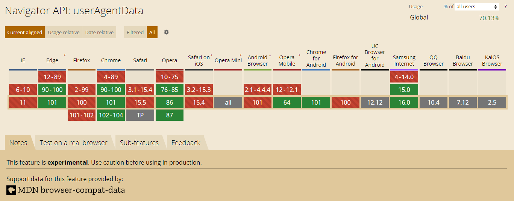

在一个小项目中我需要为不同的客户端（PC 端，移动端）提供不同的服务，所以在用户在刚使用这个服务时，会对其进行一个客户端的检测。在前端可以使用下面三种中的一个来进行判断

```js
navigator.platform;
// Win32
navigator.appVersion;
// '5.0 (Windows NT 10.0; Win64; x64) AppleWebKit/537.36 (KHTML, like Gecko) Chrome/101.0.0.0 Safari/537.36'
navigator.userAgent;
// 'Mozilla/5.0 (Windows NT 10.0; Win64; x64) AppleWebKit/537.36 (KHTML, like Gecko) Chrome/101.0.0.0 Safari/537.36'
```

但是在 TypeScript 中尝试使用这些它们都会提示这些 api 已经被标为 deprecated，并且这些 api 的对应 mdn 页面也不建议继续使用它们。推荐的是使用 User-Agent Client Hints，通过使用 navigator.userAgentData 所提供的一系列 api，我们可以获得用户使用的浏览器和操作系统等相关信息，不过由于是实验性的特性，兼容性暂时还不太好



所以在使用前可以先进行一次判断

```js
if (navigator.userAgentData) {
  // do something
} else {
  // use legacy
}
```

在 TypeScript 中没有定义相关的类型，所以需要自行定义，具体可以参考

[GitHub - lukewarlow/user-agent-data-types: TypeScript definitions for navigator.userAgentData](https://github.com/lukewarlow/user-agent-data-types)

### 参考

[Migrate to User-Agent Client Hints](https://web.dev/migrate-to-ua-ch/)
